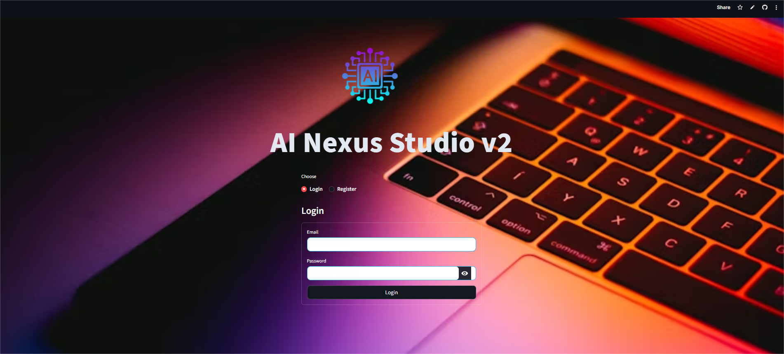
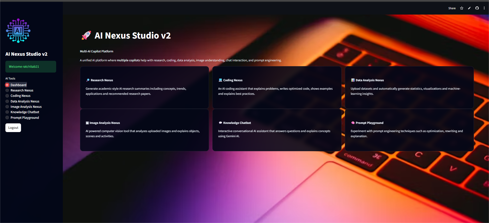
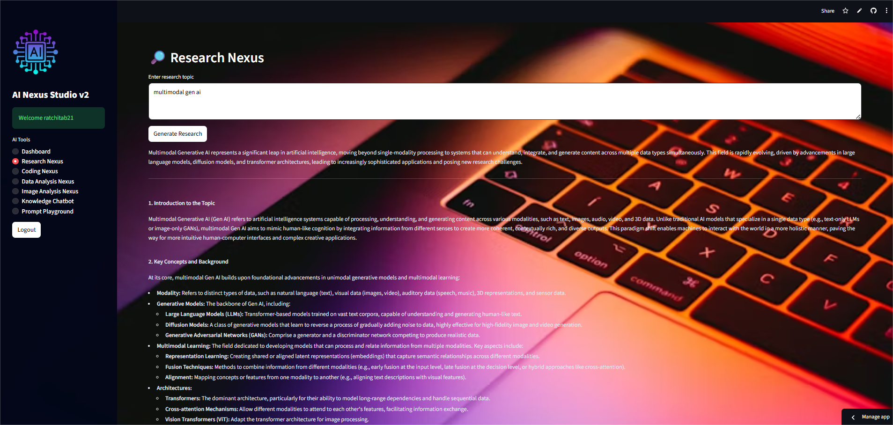
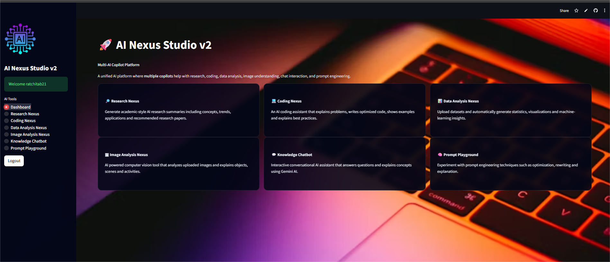
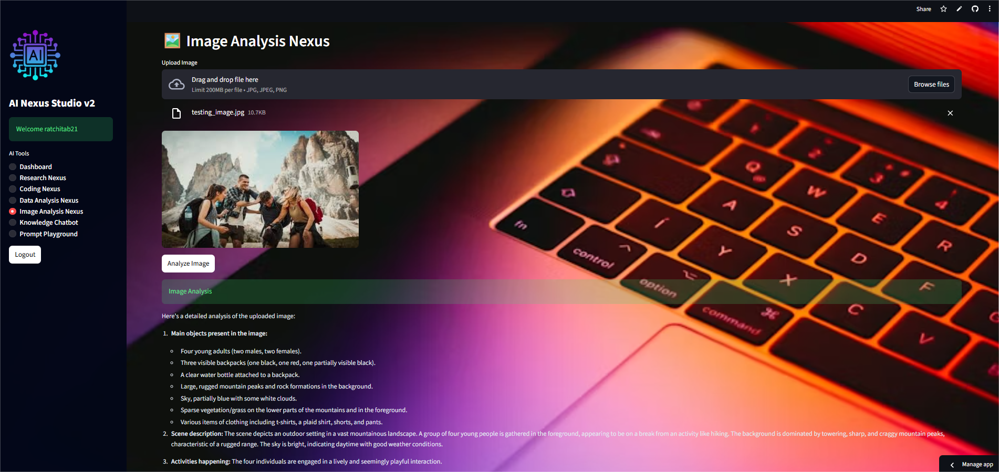
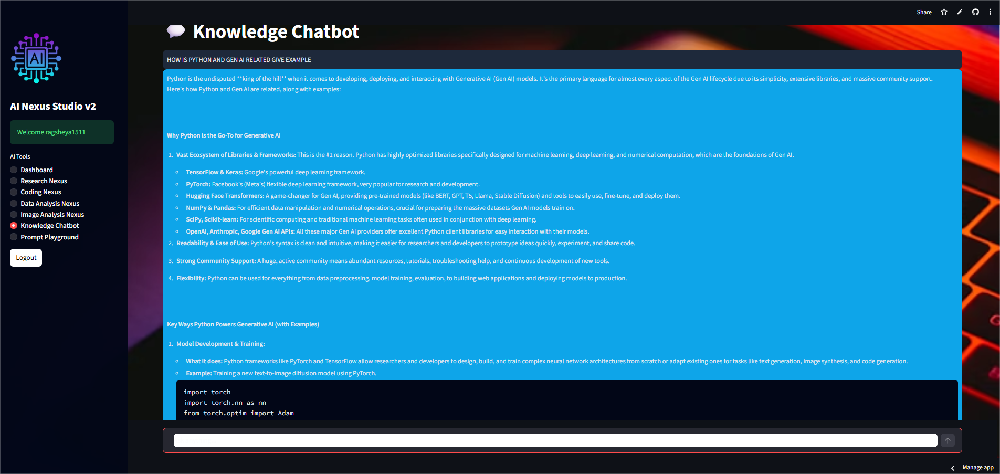
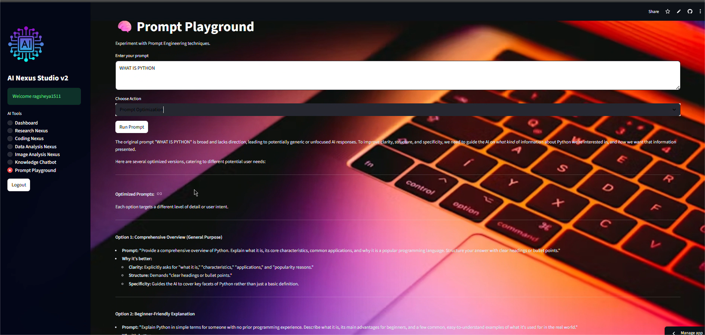

# 🚀 AI Nexus Studio v2


## 🌐 Live Demo

👉 **Streamlit App**

https://ai-nexus-studio-v2-7jgdssuwfzkbszekfrrfry.streamlit.app/

---

# 🧠 AI Nexus Studio v2

**AI Nexus Studio v2** is a **Multi-AI Copilot Platform** built with **Streamlit and Generative AI**.

It integrates multiple intelligent assistants that help with:

- 📚 Research
- 💻 Coding
- 📊 Data Analysis
- 🖼 Image Understanding
- 🤖 Knowledge Chat
- 🧠 Prompt Engineering

The goal is to provide a **single AI workspace for productivity and experimentation**.

---

# ✨ Features

### 🔐 Authentication System
- User registration
- Secure login
- Password hashing
- Session management

---

### 🔎 Research Nexus
Generate academic-style research summaries including:

- Concepts
- Background
- Key technologies
- Research trends

---

### 💻 Coding Nexus
AI coding assistant that:

- Explains problems
- Generates optimized code
- Provides step-by-step explanations
- Supports multiple programming languages

---

### 📊 Data Analysis Nexus

Upload a CSV dataset and automatically get:

- Dataset overview
- Missing value analysis
- Data types
- Statistical summaries
- Visual insights

---

### 🖼 Image Analysis Nexus

Upload images and get AI-generated explanations of:

- Objects
- Scenes
- Activities
- Context

---

### 🤖 Knowledge Chatbot

Conversational AI assistant that:

- Answers questions
- Explains concepts
- Generates examples
- Provides code snippets

---

### 🧠 Prompt Playground

Experiment with prompt engineering techniques:

- Prompt optimization
- Prompt rewriting
- Structured prompts
- Advanced prompting strategies

---

# 🖥 Screenshots

## 🔐 Login Page



---

## 📊 Dashboard



---

## 🔎 Research Nexus



---

## 📊 Data Analysis Nexus



---

## 🖼 Image Analysis Nexus



---

## 🤖 Knowledge Chatbot



---

## 🧠 Prompt Playground



---

# 🏗 Project Structure

```
ai-nexus-studio-v2
│
├── app.py
├── requirements.txt
├── README.md
├── LICENSE
│
├── auth
│   ├── auth_ui.py
│   └── auth_db.py
│
├── modules
│   ├── research_nexus.py
│   ├── coding_nexus.py
│   ├── data_nexus.py
│   ├── image_nexus.py
│   ├── knowledge_chatbot.py
│   └── prompt_playground.py
│
├── utils
│   ├── gemini_client.py
│   ├── helpers.py
│   └── ui_components.py
```

---

# ⚙️ Installation

### 1️⃣ Clone Repository

```bash
git clone https://github.com/22AD040/ai-nexus-studio-v2.git
```

---

### 2️⃣ Navigate to Folder

```bash
cd ai-nexus-studio-v2
```

---

### 3️⃣ Install Requirements

```bash
pip install -r requirements.txt
```

---

### 4️⃣ Run App

```bash
streamlit run app.py
```

---

# 📦 Requirements

```
streamlit
python-dotenv
google-genai
pandas
numpy
plotly
pillow
transformers
torch
sentence-transformers
scikit-learn
seaborn
matplotlib
```

---

# 🚀 Deployment

The app is deployed using **Streamlit Cloud**.

Steps:

1️⃣ Push code to GitHub  
2️⃣ Go to **share.streamlit.io**  
3️⃣ Deploy repository  
4️⃣ Select **app.py**

---

# 🔒 Security

Sensitive files excluded via `.gitignore`

- `.env`
- `users.db`
- `venv`
- model caches

---

# 👩‍💻 Author

**Ratchita B**

AI / ML Enthusiast  
Generative AI Developer

GitHub  
https://github.com/22AD040

---

# 📜 License

This project is licensed under the **MIT License**.

---

⭐ If you like this project, consider giving it a **star** on GitHub.